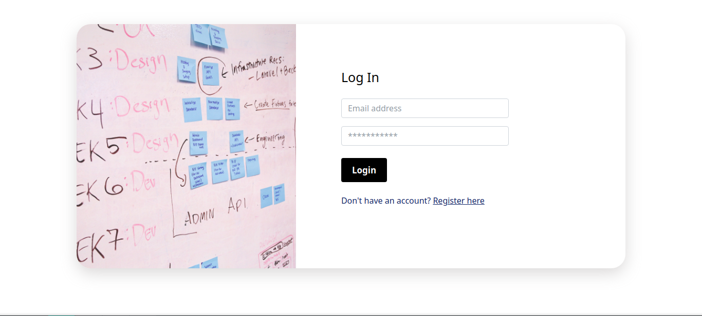

# Taskify App

**A Simple Task Manager**

## Screenshots

## NPM Packages

    taskify
    ├── __ngcc_entry_points__.json@ extraneous
    ├── @angular-devkit/build-angular@12.0.5
    ├── @angular/animations@12.0.5
    ├── @angular/cli@12.0.5
    ├── @angular/common@12.0.5
    ├── @angular/compiler-cli@12.0.5
    ├── @angular/compiler@12.0.5
    ├── @angular/core@12.0.5
    ├── @angular/forms@12.0.5
    ├── @angular/platform-browser-dynamic@12.0.5
    ├── @angular/platform-browser@12.0.5
    ├── @angular/router@12.0.5
    ├── @auth0/angular-jwt@5.0.2
    ├── @types/jasmine@3.6.11
    ├── @types/node@12.20.15
    ├── bootstrap@5.0.2
    ├── font-awesome@4.7.0
    ├── jasmine-core@3.7.1
    ├── karma-chrome-launcher@3.1.0
    ├── karma-coverage@2.0.3
    ├── karma-jasmine-html-reporter@1.6.0
    ├── karma-jasmine@4.0.1
    ├── karma@6.3.4
    ├── rxjs@6.6.7
    ├── tslib@2.3.0
    ├── typescript@4.2.4
    └── zone.js@0.11.4

## Project Structure

        .
        ├── app
        │   ├── app.component.css
        │   ├── app.component.html
        │   ├── app.component.spec.ts
        │   ├── app.component.ts
        │   ├── app.module.ts
        │   ├── app-routing.module.ts
        │   ├── controller
        │   │   ├── guards
        │   │   │   ├── Auth.guard.ts
        │   │   │   └── logged-in-guard.service.ts
        │   │   ├── interceptors
        │   │   │   └── auth.interceptor.ts
        │   │   ├── model
        │   │   │   ├── task.model.ts
        │   │   │   └── user.model.ts
        │   │   └── service
        │   │   ├── authentication.service.ts
        │   │   ├── local-storage.service.ts
        │   │   └── task.service.ts
        │   ├── footer
        │   │   ├── footer.component.css
        │   │   ├── footer.component.html
        │   │   └── footer.component.ts
        │   ├── navbar
        │   │   ├── navbar.component.css
        │   │   ├── navbar.component.html
        │   │   └── navbar.component.ts
        │   ├── task
        │   │   ├── task-creat
        │   │   │   ├── task-creat.component.css
        │   │   │   ├── task-creat.component.html
        │   │   │   └── task-creat.component.ts
        │   │   └── task-list
        │   │   ├── task-list.component.css
        │   │   ├── task-list.component.html
        │   │   └── task-list.component.ts
        │   └── user
        │   ├── login
        │   │   ├── login.component.css
        │   │   ├── login.component.html
        │   │   └── login.component.ts
        │   ├── profil
        │   │   ├── profil.component.css
        │   │   ├── profil.component.html
        │   │   └── profil.component.ts
        │   └── register
        │   ├── register.component.css
        │   ├── register.component.html
        │   └── register.component.ts
        ├── assets
            └── images
            ├── login.jpg
            └── register.jpg

## Collaborators

- Amine Ahmama
- Ahmed Dahbi
- Ouijdan Erradi
- Elwafi Elmehdi
